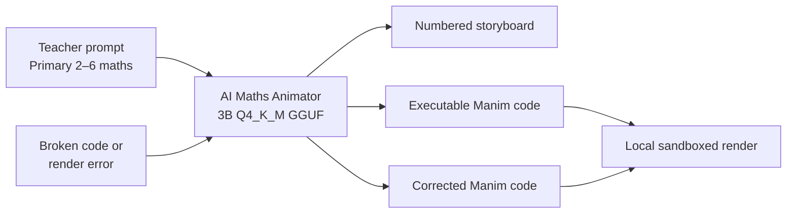
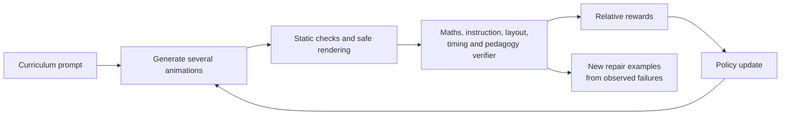

# AI Maths Animator — Primary-Mathematics 3B Offline Release

[Note]: During Testing, Judges can test the generated code in this website (https://animg.app/en/playground)

> **Turn a teacher's lesson idea into a visual storyboard or executable Manim
> animation code—locally, privately, and without requiring the teacher to know
> Python.**

AI Maths Animator is a specialist language model for creating primary-school
mathematics animations with
[Manim Community Edition](https://www.manim.community/). It can turn a natural
language teaching request into a structured storyboard or a complete Python
scene, and it can repair broken Manim programs and common mathematical
visualization errors.

This submission is the primary-mathematics supervised fine-tuning release. It
covers fractions, place value, multiplication, and division from Primary 2 to
Primary 6. The final three-billion-parameter model is distributed as a compact
`Q4_K_M` GGUF and runs locally through `llama.cpp` after a one-time download.

| Submission fact                   |                                       Measured evidence |
| --------------------------------- | ------------------------------------------------------: |
| Supervised examples               |                                               **6,023** |
| Training / validation rows        |                                         **5,722 / 301** |
| Curriculum topics                 | **Fractions, Place Value, Multiplication and Division** |
| Grade levels                      |                                 **Primary 2–Primary 6** |
| Training epochs / optimizer steps |                                             **3 / 603** |
| Selected validation NLL           |                                            **0.009423** |
| Selected checkpoint               |                                                 **603** |
| Training time                     |                     **3 h 59 min 37 s on one Tesla T4** |
| Deployment artifact               |                             **GGUF Q4_K_M, 1.7974 GiB** |
| Runtime                           |                                **`llama.cpp`, offline** |

## Why this problem matters

Many mathematical ideas become easier to understand when learners can see them
unfold. A fraction bar, place-value chart, multiplication array, or division
grouping can make an abstract rule concrete. Creating those animations normally
requires curriculum knowledge, lesson planning, Python, and familiarity with
Manim's animation APIs.

AI Maths Animator brings those skills into one workflow:

1. a teacher describes the concept and learner level;
2. the model plans or directly generates the visual explanation;
3. the teacher can inspect and edit the output; and
4. the Manim code is rendered locally into a reusable lesson video.

Offline operation matters in classrooms where connectivity is intermittent,
expensive, or unavailable. Once downloaded, the GGUF can generate lessons
without sending teacher prompts or student information to a cloud inference
service.

## What the model does



The model supports several complementary workflows:

- topic or teaching instruction → Manim code;
- topic or teaching instruction → numbered storyboard;
- storyboard → Manim code;
- broken Manim code → corrected code;
- render or Python error message → corrected code; and
- instruction, duration, layout, readability, and visual-mathematics repair.

For code tasks, the desired response is one complete Manim Community Edition
program beginning with `from manim import *`, without Markdown fences or
external assets.

## Current curriculum

### Topics

| Topic                       |  Examples |
| --------------------------- | --------: |
| Multiplication and Division |     2,147 |
| Fractions                   |     2,003 |
| Place Value                 |     1,873 |
| **Total**                   | **6,023** |

### Grade levels

| Grade     |  Examples |
| --------- | --------: |
| Primary 2 |       973 |
| Primary 3 |     1,261 |
| Primary 4 |     1,182 |
| Primary 5 |     1,322 |
| Primary 6 |     1,285 |
| **Total** | **6,023** |

Examples teach concepts such as equal fraction parts, numerator and denominator,
equivalent fractions, place-value columns, regrouping, multiplication arrays,
repeated addition, equal sharing, and division grouping. The claimed specialist
scope of this release is limited to these primary-mathematics areas.

## Dataset engineering

Instead of collecting only direct prompt-and-answer pairs, we built a multi-task
training mixture that combines generation and repair behavior.

| Source block                          |  Examples |
| ------------------------------------- | --------: |
| Foundation topic dataset              |     2,700 |
| Instruction-following repair          |       600 |
| Instruction-gap repair                |     1,000 |
| Repairs derived from real generations |       123 |
| Outcome-boost examples                |       800 |
| Targeted Manim error repairs          |       800 |
| **Total**                             | **6,023** |

The later repair blocks focus on failures that appeared in real or representative
model outputs:

- invented Manim methods and unsupported APIs;
- undefined Python variables;
- invalid keyword arguments;
- fragile LaTeX;
- wrong numbers of fraction parts or multiplication-array objects;
- incorrect division grouping and place-value labels;
- off-screen or unreadable layouts;
- animations that ignore the requested duration; and
- responses that add prose or Markdown instead of returning the requested code.

### Dataset validation

The data pipeline checked JSONL structure, conversation roles, required Manim
imports, Python syntax, scene structure, external dependencies, and known fake
API tokens. During dataset construction:

- **2,295 foundation Manim code targets rendered successfully**;
- all **800 targeted repair rows passed static validation**; and
- a stratified sample from the targeted repair block passed **24 of 24 renders**.

These are validations of the supervised targets, not measurements of generated
model outputs.

The exact training dataset SHA-256 is:

```text
1a784d85752316042438700de8c83ab5d27d246cb990b09789ac88dd34cc8fbf
```

## Model and training method

### Model lineage

```text
unsloth/Qwen2.5-Coder-3B-Instruct-bnb-4bit
        ↓ QLoRA SFT on 6,023 primary-maths examples
primary-maths-6023-run-01 / checkpoint 603
        ↓ merge + GGUF Q4_K_M quantization
Chimanwakis/qwen_manim_animation_q4_k_m_v5
```

The code-specialized Qwen2.5-Coder 3B instruction model provides the programming
foundation. Four-bit QLoRA keeps the base weights frozen while training compact
rank-32 rsLoRA adapters across the attention and MLP projection layers.

### Recorded training configuration

| Setting                          | Value                                  |
| -------------------------------- | -------------------------------------- |
| Objective                        | Completion-only supervised fine-tuning |
| Base loading                     | 4-bit QLoRA                            |
| LoRA rank / alpha / dropout      | 32 / 32 / 0.0                          |
| LoRA variant                     | Rank-stabilized LoRA                   |
| Target modules                   | Q, K, V, O, gate, up, down projections |
| Maximum sequence length          | 1,280 tokens                           |
| Training packing                 | BFD packing enabled                    |
| Micro-batch / accumulation       | 2 / 8                                  |
| Effective batch                  | 16 packed sequences                    |
| Epochs                           | 3                                      |
| Optimizer                        | 8-bit AdamW                            |
| Peak learning rate               | `1e-4`                                 |
| Schedule                         | Cosine decay with 5% warmup            |
| Weight decay / gradient clipping | 0.01 / 1.0                             |
| Evaluation and checkpointing     | Once per epoch                         |
| Best-model metric                | Minimum validation NLL                 |
| Seed                             | 3407                                   |

Completion-only loss trains the desired assistant response while masking the
system and user prompt tokens. Sequence packing reduces padding overhead while
keeping evaluation rows separate and interpretable.

The full trainer and Colab workflow are included under [`src/`](src/):

- [`src/train_unsloth_sft.py`](src/train_unsloth_sft.py); and
- [`src/Primary_Maths_6023_SFT_Colab.ipynb`](src/Primary_Maths_6023_SFT_Colab.ipynb).

## Training results

The run completed all three epochs and 603 optimizer steps on one Tesla T4.
Validation NLL decreased at each checkpoint, so the final checkpoint was selected.

| Epoch | Step | Last logged training NLL | Validation NLL | Validation perplexity |
| ----: | ---: | -----------------------: | -------------: | --------------------: |
|     1 |  201 |     0.015472 at step 200 |       0.013588 |              1.013680 |
|     2 |  402 |     0.009501 at step 400 |       0.009880 |              1.009929 |
|     3 |  603 |     0.007535 at step 600 |   **0.009423** |          **1.009468** |

| Final training statistic                 |                         Value |
| ---------------------------------------- | ----------------------------: |
| Run-average training NLL                 |                      0.041657 |
| Best checkpoint                          |              `checkpoint-603` |
| Training runtime                         | 14,377.47 s (3 h 59 min 37 s) |
| Training throughput                      |      0.669 packed sequences/s |
| Optimizer throughput                     |                 0.042 steps/s |
| Final evaluation runtime                 |                       89.72 s |
| Total floating-point operations reported |              `1.7771 × 10^17` |

Validation NLL improved by 30.65% between epochs 1 and 3. The third epoch still
improved the recorded objective by 4.63% over epoch 2, supporting selection of
checkpoint 603.


The loss curve demonstrates successful in-distribution optimization. It is not
held-out render accuracy. The validation rows come from the same largely
synthetic, templated corpus, so independent generation, rendering, mathematical,
and human evaluation remain necessary.

Detailed evidence is available in [`REPORT.md`](REPORT.md), with raw metrics,
trainer state, histories, hashes, and published-model metadata under
[`sft-report-data/`](sft-report-data/).

## Final offline model

The final model is published at
[`Chimanwakis/qwen_manim_animation_q4_k_m_v5`](https://huggingface.co/Chimanwakis/qwen_manim_animation_q4_k_m_v5).

| Artifact property               | Value                                                              |
| ------------------------------- | ------------------------------------------------------------------ |
| Remote file                     | `qwen2.5-coder-3b-instruct.Q4_K_M.gguf`                            |
| Quantization                    | `Q4_K_M`                                                           |
| File size                       | 1,929,902,720 bytes (1.7974 GiB)                                   |
| Architecture                    | Qwen2 causal language model                                        |
| Parameter estimate              | 3.09B                                                              |
| Training/export sequence length | 1,280 tokens                                                       |
| Pinned Hub revision             | `91a4ff76dacebc59f954698831e3ec1afc89135f`                         |
| SHA-256                         | `74f3523c47193a67183ceee512087e38aa615848ff56402e8d6355144217a40a` |

The download script intentionally stores the remote GGUF at the submission's
local compatibility path:

```text
model/qwen_manim_animation_16bit.Q4_K_M.gguf
```

The pinned revision and checksum prevent the evaluator from silently receiving
a different model version.

## Reproducible quick start

### 1. Download and verify the model

```bash
bash download_model.sh
```

The script downloads the pinned public model into `model/`, verifies SHA-256,
and refuses a corrupt or incomplete file.

### 2. Build `llama.cpp`

```bash
git clone https://github.com/ggml-org/llama.cpp
cmake -S llama.cpp -B llama.cpp/build -DCMAKE_BUILD_TYPE=Release
cmake --build llama.cpp/build --config Release -j4
```

### 3. Run locally

```bash
./llama.cpp/build/bin/llama-cli \
  -m model/qwen_manim_animation_16bit.Q4_K_M.gguf \
  -cnv \
  -t 4 \
  -c 1280 \
  -n 1024 \
  --temp 0.2 \
  --top-p 0.9
```

Recommended system prompt:

```text
You are a specialist coding assistant for primary-school mathematics animations.
Follow the user's request exactly. When asked for Manim code, output only complete
executable Python code for Manim Community Edition, starting with
`from manim import *`, with exactly one Scene class, no markdown fences, and no
external assets. When asked for a storyboard, output only a numbered storyboard
with short scenes and no code. Keep the maths correct, visual models clear, and
language child-friendly.
```

The model was trained and exported with a 1,280-token limit. A larger context may
be technically accepted by the base architecture, but it was not evaluated in
this run and should not be presented as a measured capability.

## Public demonstration prompts

### Fractions

```text
Create a complete Manim Community Edition Python scene for Primary 3 pupils
explaining 3/4. Show one rectangular fraction bar divided into 4 equal parts,
shade exactly 3 parts blue, display the fraction label, and finish with a short
recap. Return only executable Manim code.
```

### Multiplication

```text
Create a complete Manim Community Edition Python scene for Primary 4 pupils
explaining 6 × 4 using an array with exactly 6 rows and 4 objects in each row.
Show repeated addition, display the answer 24, and finish with a recap. Return
only executable Manim code.
```

These match the two public prompts in [`metadata.json`](metadata.json). They are
demonstrations, not a substitute for a larger hidden evaluation set.

## ADTC challenge alignment

| Judging dimension              | Design response                                                                             |
| ------------------------------ | ------------------------------------------------------------------------------------------- |
| Accuracy                       | Multi-task curriculum data plus generation and realistic repair examples                    |
| Performance                    | Compact 3B architecture and native `llama.cpp` GGUF inference                               |
| Efficiency                     | 1.7974-GiB Q4_K_M weights and bounded 1,280-token evaluation context                        |
| Cross-disciplinary integration | Mathematics education, visual lesson design, and executable code generation                 |
| Offline value                  | No inference API or network connection required after download                              |
| Auditability                   | Pinned revision, checksums, source scripts, full training history, and explicit limitations |

### Target environment

- Ubuntu 22.04 LTS;
- 4 CPU cores;
- 8 GB system RAM with the challenge's inference-process ceiling;
- integrated graphics, with no discrete GPU assumed for inference;
- `llama.cpp`; and
- no network access during judged inference.

### On-device profiler results

The participant-mode results are preserved in [`submission.json`](submission.json).
They were produced with `adtc-profiler 0.1.0` using schema version `1.1.0`.

| Measured environment             | Recorded value                        |
| -------------------------------- | ------------------------------------- |
| Device class                     | Participant laptop                    |
| Operating system                 | Windows 11 (`10.0.26200`)             |
| CPU                              | Intel64 Family 6 Model 154 Stepping 3 |
| GPU                              | NVIDIA GeForce RTX 3050 Ti Laptop GPU |
| System RAM                       | 15.7 GB                               |
| Model parameters detected        | 3,085,938,688                         |
| Claimed/detected parameter match | Yes                                   |

| Profiler metric              |                          Measured result |
| ---------------------------- | ---------------------------------------: |
| Generation throughput        |                       **27.48 tokens/s** |
| Time to first token          |                            **476.91 ms** |
| Profiler workload            | 512 prompt tokens / 128 generated tokens |
| Peak process RSS             |                          **2,037.93 MB** |
| Steady-state process RSS     |                              1,927.09 MB |
| Peak process VMS             |                                848.80 MB |
| CPU utilization, p99         |                                    92.2% |
| Thermal throttling reported  |                                   **No** |
| Peak core temperature        |                             Not recorded |
| ARC-Easy normalized accuracy |                 **0.78 over 50 samples** |

ARC-Easy measures general reasoning and is not a Manim render-success or
primary-mathematics animation score. The performance measurements describe the
recorded RTX 3050 Ti participant laptop and should not be interpreted as
integrated-graphics-only results. The profiler records random seed `42` and Git
revision `b453c1bb85ee` for reproducibility.

To reproduce the participant-mode profile:

```bash
adtc-profiler run \
  --submission "$PWD" \
  --mode participant \
  --output submission.json
```

## Evaluation status and plan

Training and validation losses are optimization measurements, not animation
accuracy. A fair evaluation will compare the untouched Qwen2.5-Coder base with
the final SFT model on the same independently authored prompts.

The planned evaluation measures:

| Dimension                | Check                                                                |
| ------------------------ | -------------------------------------------------------------------- |
| Output format            | Code-only or storyboard-only response as requested                   |
| Python validity          | `ast.parse` succeeds                                                 |
| Manim structure          | Required import, one scene, and one `construct` method               |
| Render success           | Scene renders in an isolated Manim environment                       |
| Mathematical correctness | Required quantities, equations, counts, and conclusions are visible  |
| Instruction following    | Grade, visual model, colour, layout, duration, and recap constraints |
| Visual integrity         | No off-frame objects, unresolved overlaps, or unreadable text        |
| Pedagogy                 | Clear progression from concept to demonstration and recap            |
| Quantization fidelity    | Compare final adapter outputs with Q4_K_M outputs                    |

Primary reporting will use deterministic pass@1 generation. Code outputs will be
treated as untrusted and rendered only inside a sandbox.

## Known limitations

1. Specialist supervised coverage is limited to fractions, place value,
   multiplication, and division for Primary 2–Primary 6.
2. Validation uses a row split from the same mostly synthetic and templated
   corpus, so its low NLL is not independent task accuracy.
3. Complete held-out render and mathematical evaluation is still pending.
4. Q4_K_M behavior has not yet been compared systematically with the final
   higher-precision adapter.
5. The recorded inference profile used an RTX 3050 Ti laptop GPU; performance
   on the integrated-graphics target still depends on the evaluator's hardware.
6. Manim code can parse successfully and still contain runtime, layout,
   mathematical, or pedagogical problems.
7. The generated animation code must never be executed without inspection and
   isolation.

## What's next

The next training phase will use Group Relative Policy Optimization (GRPO) to
move beyond imitation of reference answers and optimize directly for animation
outcomes. For each teaching prompt, the model will generate multiple candidate
programs and learn from their relative verifier scores.

Designing a strong verifier is central to that work. The verifier will combine
static safety and syntax checks, isolated Manim rendering, runtime telemetry,
curriculum-specific mathematical evidence, exact visual-count checks,
instruction following, layout, timing, and teaching progression. The goal is to
reward genuinely useful lessons rather than code that passes only superficial
format checks.

We will also expand the curriculum into geometry, measurement, algebra,
statistics, probability, functions, limits, differentiation, integration, and
other secondary-school and university topics. Each new area will receive its own
validated data, mathematical checks, held-out prompts, and educator review before
we claim specialist coverage.

The long-term improvement loop is:



## Repository structure

```text
.
├── README.md
├── REPORT.md
├── metadata.json
├── submission.json
├── download_model.sh
├── model/
│   └── .gitkeep
├── src/
│   ├── train_unsloth_sft.py
│   └── Primary_Maths_6023_SFT_Colab.ipynb
└── sft-report-data/
    ├── training_history.csv
    ├── trainer_state.json
    ├── train_results.json
    ├── eval_results.json
    ├── sft_report_summary.json
    ├── sft_report_table.csv
    ├── sft_loss_curve.png
    └── huggingface/
        ├── export_manifest.json
        ├── SHA256SUMS
        ├── README.md
        ├── Modelfile
        └── model_api_snapshot.json
```

## Submission readiness

- [x] Public Q4_K_M GGUF hosted on Hugging Face
- [x] Pinned model revision and SHA-256 download verification
- [x] Model weights excluded from Git
- [x] Exactly two public primary-mathematics prompts in `metadata.json`
- [x] Offline `llama.cpp` packaging
- [x] Training script and Colab notebook included
- [x] Full SFT report and raw metric evidence included
- [x] Participant-mode profiler results retained in `submission.json`
- [x] Measured latency, throughput, memory, CPU, and thermal status documented

## Links and references

- [Final Q4_K_M model](https://huggingface.co/Chimanwakis/qwen_manim_animation_q4_k_m_v5)
- [Dataset](https://huggingface.co/datasets/Chimanwakis/manim_animation_dataset)
- [Qwen2.5-Coder technical report](https://arxiv.org/abs/2409.12186)
- [Manim Community Edition](https://www.manim.community/)
- [ADTC 2026 official challenge](https://africadeeptech.org/challenge-2026/)
- [ADTC submission template](https://github.com/Africa-Deep-Tech-Foundation/adtc-2026-submission-template)
- [ADTC profiler](https://github.com/Africa-Deep-Tech-Foundation/adtc-profiler)
- [`llama.cpp`](https://github.com/ggml-org/llama.cpp)

## License

Submission code and documentation are provided under the repository's GNU GPL
v3 license. The starting model identifies its upstream license as Apache 2.0;
users must review all applicable model, dataset, and dependency terms before
redistribution.
