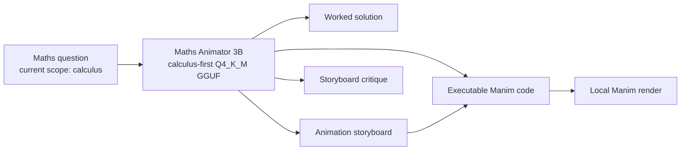

# Maths Animator — Calculus-First 3B Release

> **From mathematics questions to worked explanations, visual storyboards, and
> executable Manim scenes—entirely offline on the laptop a learner already has.**

Maths Animator is an offline AI system for turning mathematics into clear,
editable animations. It combines mathematical reasoning, teaching design, and
program synthesis: instead of returning only a final answer, it can explain a
problem, plan how to teach it visually, and generate Manim Community Edition
Python code that an educator can inspect, edit, and render locally.

This submission is the **calculus-first release** of that broader Maths Animator
vision. We deliberately began with a deep, coherent single-variable calculus
curriculum—functions, limits, continuity, differentiation fundamentals, and
differentiation rules—rather than claiming shallow coverage of every branch of
mathematics. The current 3.086-billion-parameter model's measured specialist
claims apply to that curriculum. Its final `Q4_K_M` GGUF is 1.93 GB and runs
through `llama.cpp`, enabling private, zero-cloud inference after the one-time
model download.

| Submission fact | Evidence |
|---|---:|
| Specialized SFT examples | **17,250** |
| Independent training / validation rows | **16,728 / 522** |
| Problem groups in training / validation | **3,853 / 122** |
| Supervised task families | **7** |
| Manim targets passing Python parsing | **8,000 / 8,000** |
| Best validation loss | **0.109954** |
| Best checkpoint | **step 2,000, epoch 1.912** |
| Final deployment artifact | **GGUF `Q4_K_M`, 1.93 GB** |
| Runtime | **`llama.cpp`, offline** |

## Why this problem matters

Many mathematical ideas are difficult to teach from static symbolic steps
alone. Changes in a graph, a geometric construction, an accumulating quantity,
or a secant approaching a tangent are easier to understand when learners can see
the underlying process unfold. Producing a good mathematical animation normally
requires three separate competencies:

1. solve the mathematics correctly;
2. design a pedagogically meaningful visual sequence; and
3. implement that sequence in executable animation code.

Maths Animator is designed to bridge all three. In this first release, a teacher
can ask for a calculus solution, refine it into a storyboard, or generate a
complete Manim scene that remains inspectable and editable. A learner can
request a visual explanation without sending the question, identity, or learning
history to a cloud service. The same question → reasoning → storyboard → code
pipeline is designed to extend to other mathematics curricula in later releases.

Offline operation is a functional requirement, not a cosmetic feature. The
[ITU Facts and Figures 2025](https://www.itu.int/itu-d/reports/statistics/2025/10/15/ff25-internet-use/)
reports that 36% of people in Africa used the Internet in 2025, compared with 74%
globally; rural Internet use in Africa was approximately 21%. A compact local
model keeps a lesson available when connectivity is unavailable, intermittent,
or too expensive for repeated long-form code generation.

## What the calculus-first model does



The education pairing is load-bearing: mathematical reasoning determines what
must be shown; learning design determines the order and visual emphasis; code
generation makes the explanation reproducible. Removing any one of these layers
reduces the system to either a generic chatbot, a static answer key, or an
animation generator with no assurance that its visuals follow the mathematics.

### Seven supervised workflows

| Task | Examples | Capability learned |
|---|---:|---|
| Storyboard → Manim code | 3,500 | Turn a visual teaching plan into an executable scene |
| Question → worked solution | 3,000 | Solve and explain the calculus accurately |
| Solution → storyboard | 3,000 | Translate reasoning into a teachable visual sequence |
| Question → storyboard | 3,000 | Plan a lesson directly from the problem |
| Question → Manim code | 2,500 | Produce a complete visualization end to end |
| Question + solution → Manim code | 2,000 | Ground code in a supplied correct derivation |
| Storyboard critique | 250 | Detect mathematical and visual design problems |

This multi-stage design supports both direct generation and human-in-the-loop
workflows. An educator can inspect the intermediate solution or storyboard before
running any generated code.

## First release: calculus curriculum

The 17,250-example corpus covers five top-level curriculum families. Counts are
from the released dataset rather than estimated from prompts.

| Curriculum family | Examples | Share |
|---|---:|---:|
| Functions and prerequisites | 5,250 | 30.4% |
| Limits | 3,000 | 17.4% |
| Continuity | 3,000 | 17.4% |
| Differentiation fundamentals | 3,000 | 17.4% |
| Differentiation rules | 3,000 | 17.4% |
| **Total** | **17,250** | **100%** |

### Functions and prerequisites

- Function notation, domains, and ranges
- Graph transformations
- Polynomial, rational, exponential, logarithmic, and trigonometric functions
- Inverse and composite functions

### Limits

- Numerical and graphical limits
- Algebraic limit evaluation
- One-sided and infinite limits
- Limits at infinity
- Indeterminate forms
- Squeeze theorem
- Formal epsilon–delta proofs

### Continuity

- Continuity at a point and on an interval
- Types of discontinuities
- Intermediate and extreme value theorems
- Parameter-based continuity problems

### Differentiation fundamentals

- Derivative from first principles
- Geometric and physical interpretations
- Differentiability versus continuity
- Higher-order derivatives

### Differentiation rules

- Power, product, quotient, and chain rules
- Exponential and logarithmic derivatives
- Trigonometric and inverse-trigonometric derivatives
- Hyperbolic-function derivatives
- Implicit differentiation
- Logarithmic differentiation
- Parametric differentiation

The Maths Animator product vision is broader than calculus, but the current
model's specialist claim is intentionally limited to this curriculum.
Integration, sequences and series, differential equations, multivariable
calculus, and non-calculus mathematics are roadmap items rather than claimed
supervised coverage in this release.

## Dataset engineering and quality control

The public dataset is hosted at
[`Chimanwakis/calculus_manim`](https://huggingface.co/datasets/Chimanwakis/calculus_manim).
Its released JSONL is 68,288,159 bytes with SHA-256
`a226f0ef3368d298d7b162b18f232058cf7157a39c0cb7cb69a6ffd10c4d036a`.

### Validation gates

- **17,250 unique IDs** and **17,250 unique training pairs**
- **Zero duplicate IDs** and **zero duplicate training pairs**
- Six validated source collections combined by deterministic SHA-256 shuffling
- Eighteen source-schema variants normalized into one explicit conversational
  prompt/completion representation
- **8,000 Manim code targets parsed as Python with zero syntax errors**
- Source records preserved verbatim in the released canonical dataset
- Final output never reused as an input source during corpus construction
- The legacy 6,023-example primary-maths corpus explicitly excluded from this
  calculus training run

Static parsing proves syntactic validity, not successful rendering. Render
success, mathematical correctness, layout quality, and visual pedagogy remain
separate evaluation dimensions.

### Leakage-resistant validation

Several task rows can represent the same underlying problem—for example, one row
asks for a solution while aligned rows ask for a storyboard or Manim code. A
random row split would leak the same mathematical problem across training and
validation and make the loss look better than real generalization.

The trainer therefore grouped rows by canonical problem identity before creating
the deterministic 3% validation split:

- **3,853 training problem groups / 122 validation problem groups**
- **16,728 training rows / 522 validation rows**
- **zero group overlap**

The conversion step also inserted explicit task instructions and reconstructed
missing problem context for solution-to-storyboard records. This removed prompt
ambiguity and produced 17,250 unique, non-conflicting supervised prompts.

## Model and training method

### Model lineage

```text
Qwen2.5-Coder-3B-Instruct
        ↓ previous Manim specialization
Chimanwakis/qwen_manim_animation_16bit
        ↓ calculus QLoRA SFT on 17,250 examples
Qwen-Calculus-SFT final adapter
        ↓ merge + GGUF Q4_K_M quantization
qwen_manim_animation_16bit.Q4_K_M.gguf
```

The starting checkpoint uses the Qwen2 architecture with 3,085,938,688
parameters. The calculus stage was parameter-efficient QLoRA training with
Unsloth and TRL in Google Colab.

### Training configuration

| Setting | Value |
|---|---|
| Training objective | Completion-only supervised fine-tuning |
| Loaded precision | 4-bit QLoRA |
| LoRA rank / alpha | 32 / 32 |
| LoRA dropout | 0.0 |
| LoRA variant | rank-stabilized LoRA |
| Target modules | `q`, `k`, `v`, `o`, `gate`, `up`, and `down` projections |
| Maximum sequence length | 8,192 tokens |
| Micro-batch / accumulation | 1 / 16 |
| Effective batch size | 16 examples |
| Epochs | 2 |
| Optimizer | 8-bit AdamW |
| Peak learning rate | `5e-5` |
| Schedule | cosine decay with 5% warmup |
| Weight decay / max gradient norm | 0.01 / 1.0 |
| Packing | disabled |
| Seed | 3407 |
| Evaluation and checkpoint interval | 250 optimizer steps |
| Best-model selection | minimum validation loss |

Completion-only loss prevents the prompt and system instructions from dominating
the learning signal. The 8,192-token ceiling was selected for long storyboards
and Manim programs; the trainer tokenized every example before allocating the
model and refused silent target truncation. Packing remained disabled to preserve
broad Colab compatibility.

## Training results

The run completed all 2 epochs and 2,092 optimizer steps without NaN or infinite
loss values. Validation loss decreased monotonically until step 2,000 and then
plateaued.

| Step | Epoch | Validation loss |
|---:|---:|---:|
| 250 | 0.239 | 0.372878 |
| 500 | 0.478 | 0.245271 |
| 750 | 0.717 | 0.174433 |
| 1,000 | 0.956 | 0.142671 |
| 1,250 | 1.195 | 0.126944 |
| 1,500 | 1.434 | 0.115572 |
| 1,750 | 1.673 | 0.111812 |
| **2,000** | **1.912** | **0.109954** |
| 2,092 | 2.000 | 0.110014 |

| Final training statistic | Value |
|---|---:|
| Best validation loss | **0.109954014** |
| Final evaluation after restoring best checkpoint | **0.109954096** |
| Whole-run average training loss | 0.106528457 |
| Best checkpoint | `checkpoint-2000` |
| Training runtime | 45,986 seconds (**12 h 46 min**) |
| Training samples per second | 0.728 |
| Optimizer steps per second | 0.045 |
| Total floating-point operations reported | `4.663 × 10^17` |

Validation loss fell by 70.5% from the first evaluation to the selected
checkpoint. The last 92 steps changed validation loss by only +0.054%, indicating
that two epochs were sufficient and that another identical epoch would offer
little evidence-based benefit. The final adapter was saved after TRL restored
checkpoint 2,000, so the deployed model uses the best observed weights rather
than the last weights.

Loss measures in-distribution token prediction. It does **not** by itself prove
mathematical correctness, Manim render success, or teaching quality; those are
covered by the proposed task-level evaluation below.

## Offline deployment artifact

The public deployment repository is
[`Chimanwakis/qwen-calculus-sft-GGUF`](https://huggingface.co/Chimanwakis/qwen-calculus-sft-GGUF).

| Artifact property | Value |
|---|---|
| File | `qwen_manim_animation_16bit.Q4_K_M.gguf` |
| Quantization | `Q4_K_M` |
| File size | 1,929,902,560 bytes (1.93 GB decimal) |
| Parameters encoded | 3,085,938,688 |
| Architecture | Qwen2 causal language model |
| Embedded maximum context | 32,768 tokens |
| Recommended ADTC context | 4,096 tokens pending profiler confirmation |
| Pinned Hub revision | `37671020bb1969a74f4d70c0fe579db2116e2335` |
| SHA-256 | `ce615628876cde1632fc091dace4f03062650d5ccfe0922528c9ea02645db389` |

`Q4_K_M` was selected over the 16-bit model because the 16-bit weights alone are
approximately 6.17 GB before runtime buffers and the KV cache. The 1.93 GB GGUF
leaves substantially more of the ADTC 7 GB process ceiling for context and
inference buffers. Higher-precision GGUF variants may retain more weight fidelity,
but were not selected for the constrained-laptop submission. Lower-bit variants
could reduce memory further, but were not used because mathematical notation and
code generation are sensitive to quantization loss.

## Reproducible quick start

### 1. Download and verify the pinned model

```bash
bash download_model.sh
```

The script downloads the exact pinned revision, verifies SHA-256, and refuses a
corrupt or incomplete file.

### 2. Build `llama.cpp`

```bash
git clone https://github.com/ggml-org/llama.cpp
cmake -S llama.cpp -B llama.cpp/build -DCMAKE_BUILD_TYPE=Release
cmake --build llama.cpp/build --config Release -j4
```

### 3. Run locally

```bash
./llama.cpp/build/bin/llama-cli \
  -m model/qwen_manim_animation_16bit.Q4_K_M.gguf \
  -cnv \
  -t 4 \
  -c 4096 \
  -n 2048 \
  --temp 0.2 \
  --top-p 0.9
```

Recommended system prompt:

```text
You are an expert mathematics educator and Manim Community Edition developer.
This release specializes in functions, limits, continuity, and differentiation.
Follow the requested task and output format exactly. Preserve all mathematical
conditions, notation, reasoning, and conclusions supplied in the input.
```

For code generation, explicitly request one executable Manim Community scene,
Python code only, beginning with `from manim import *`, without Markdown fences.

## ADTC challenge alignment

The official ADTC scoring formula gives 50% to accuracy, 30% to performance, and
20% to efficiency, subject to a hard memory ceiling. This design addresses each
component directly.

| Judging dimension | Design response |
|---|---|
| Accuracy | Deep calculus-first curriculum; seven aligned reasoning/visual/code tasks; grouped validation; best-checkpoint selection |
| Performance | Compact 3B architecture and native `llama.cpp` GGUF execution |
| Efficiency | 1.93 GB `Q4_K_M` weights, four-thread CPU profile, bounded 4,096-token evaluation context |
| Cross-disciplinary integration | Mathematics education is encoded in the solution → storyboard → executable-animation pipeline |
| Offline value | No inference API, account, or network dependency; prompts and outputs remain local |
| Auditability | Public dataset and model, pinned revision, checksum, deterministic split, explicit limitations |

### Target environment

- Ubuntu 22.04 LTS
- 4 CPU cores
- 8 GB system RAM with a strict 7 GB inference-process ceiling
- Integrated graphics; no discrete GPU assumption
- `llama.cpp` only
- Zero network access during judged inference

### On-device benchmark status

Training metrics above are measured. The following inference metrics must be
filled from the official participant-mode ADTC profiler; they are intentionally
not fabricated.

| Metric | Current status |
|---|---|
| Peak inference RAM | **Pending ADTC profiler** |
| Time to first token | **Pending ADTC profiler** |
| Prompt-processing speed | **Pending ADTC profiler** |
| Generation speed | **Pending ADTC profiler** |
| Thermal penalty / throttling | **Pending ADTC profiler** |
| Official participant accuracy score | **Pending ADTC profiler** |

Run the complete benchmark before submission:

```bash
adtc-profiler run \
  --submission "$PWD" \
  --mode participant \
  --output submission.json
```

The official evaluator will repeat the run on the standard laptop. Retain the
generated `submission.json` as evidence; do not substitute development-GPU
numbers for CPU-only inference measurements.

## Task-level evaluation plan

The 522-row validation loss is useful for checkpoint selection, but a strong
maths-animation model requires execution-aware evaluation. A separate held-out
suite is designed to score each output along these axes:

| Dimension | Proposed check |
|---|---|
| Mathematical correctness | Symbolic/numeric answer and derivation review |
| Instruction following | Correct requested output type and no unwanted prose/fences |
| Python validity | `ast.parse` succeeds |
| Manim validity | Scene imports and renders successfully with Manim Community |
| Visual integrity | No frame overflow, unreadably small text, or unresolved overlap |
| Pedagogical fidelity | Animation order matches the mathematical reasoning |
| Robustness | Novel constants, alternative wording, and hidden problem groups |

The repository now includes a
[`35-case calculus-first specialist test set`](evaluation/calculus_manim_test_v1.json)
with references and observable requirements, plus a
[`scoring guide`](evaluation/README.md). It covers every combination of the five
trained curriculum families and seven supervised task types. The cases were
authored after SFT and are not extracted training rows; validation found no exact
normalized prompt match against the 17,250-example training JSONL. Test scores
remain pending and are not inferred from validation loss.

The two public ADTC prompts should be treated as demonstrations, not the whole
test set. Hidden prompts and novel calculus problems are essential for detecting
template memorization.

## Safety, privacy, and responsible use

- Generated mathematics can still be wrong; educators should verify high-stakes
  explanations and final answers.
- Generated Python is executable code and should run in a sandboxed environment
  without unnecessary filesystem or network permissions.
- Maths Animator is an educational authoring assistant, not an autonomous
  examiner or grading authority.
- Offline inference keeps student questions and drafts on the local device.
- The current release is English-only and does not claim the African-language
  bonus.

## Known limitations

1. Specialist supervised coverage currently ends at differentiation rules.
2. “Maths Animator” describes the system direction; this release does not claim
   specialist training across all branches of mathematics.
3. Training results are aggregate; per-topic and per-task losses were not logged.
4. Python parsing does not guarantee a successful Manim render or good layout.
5. The 522 validation rows share the released corpus distribution; external
   curriculum and adversarial testing remain necessary.
6. CPU speed, peak RAM, and thermal behavior must still be measured with the
   official ADTC profiler.
7. Long Manim programs may require more generation tokens and context memory than
   short mathematical explanations.

These boundaries are stated explicitly so judges can distinguish measured
engineering evidence from future claims.

## Roadmap: from calculus first to a broader Maths Animator

- Complete the calculus pathway with integration, applications of integration,
  sequences and series, differential equations, and multivariable calculus.
- Expand the same verified reasoning-to-animation pipeline into algebra,
  geometry, trigonometry, statistics, probability, and discrete mathematics.
- Build curriculum-specific evaluation sets before claiming specialist coverage
  for each new branch of mathematics.
- Introduce render-in-the-loop repair data using real Manim error traces.
- Report task-specific mathematical, syntax, render, layout, and pedagogy scores.
- Distill or selectively quantize for faster CPU decoding while protecting math
  and code quality.
- Add teacher controls for lesson duration, learner level, visual density, and
  accessibility.
- Develop meaningful African-language instruction and terminology with educators
  rather than relying on direct machine translation.

## Two-minute demonstration plan

1. Disable networking and show the 1.93 GB GGUF running through `llama.cpp`.
2. Introduce Maths Animator as a general maths-animation system whose first
   specialist release is calculus.
3. Submit an unseen derivative-from-first-principles prompt.
4. Show the model generate a worked derivation and executable Manim code.
5. Render the scene locally and show the secant-to-tangent animation.
6. Display process memory and tokens/second from the ADTC profiler.
7. Close with the public dataset, pinned checksum, classroom workflow, and the
   roadmap from calculus to wider mathematics.

## Submission readiness

- [x] Public GGUF hosted on Hugging Face
- [x] Pinned model revision and SHA-256 download verification
- [x] Model weights excluded from Git
- [x] Exactly two public test prompts in `metadata.json`
- [x] Offline `llama.cpp` packaging
- [x] Full training and dataset evidence documented
- [ ] Replace `TODO_REPLACE_TEAM_ID` in `metadata.json` with the registered team ID
- [ ] Run the full participant-mode ADTC profiler and retain `submission.json`
- [ ] Add measured CPU/RAM/thermal results to this report
- [ ] Record the two-minute offline demonstration video

## Links and references

- [GGUF model](https://huggingface.co/Chimanwakis/qwen-calculus-sft-GGUF)
- [Calculus training dataset](https://huggingface.co/datasets/Chimanwakis/calculus_manim)
- [Starting Manim SFT checkpoint](https://huggingface.co/Chimanwakis/qwen_manim_animation_16bit)
- [ADTC 2026 official challenge](https://africadeeptech.org/challenge-2026/)
- [ADTC submission template](https://github.com/Africa-Deep-Tech-Foundation/adtc-2026-submission-template)
- [ADTC profiler](https://github.com/Africa-Deep-Tech-Foundation/adtc-profiler)
- [ITU Facts and Figures 2025](https://www.itu.int/itu-d/reports/statistics/facts-figures-2025/)
- [`llama.cpp`](https://github.com/ggml-org/llama.cpp)

## License

Submission code and documentation are provided under the repository's GNU GPL
v3 license. The starting model identifies its upstream license as Apache 2.0;
users must review all applicable model and dataset terms before redistribution.
