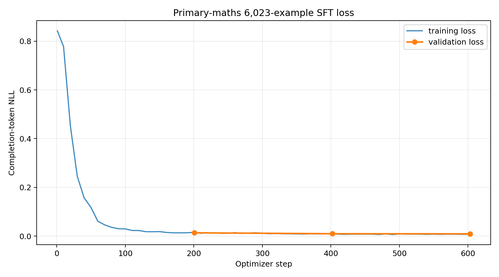

# Supervised Fine-Tuning Report: Primary-Mathematics Manim Code Generation

**Document status:** Completed SFT training and GGUF publication  
**Report date:** 23 August 2026  
**Training run:** `primary-maths-6023-run-01`  
**Published model:** [`Chimanwakis/qwen_manim_animation_q4_k_m_v5`](https://huggingface.co/Chimanwakis/qwen_manim_animation_q4_k_m_v5)  
**Published revision:** `91a4ff76dacebc59f954698831e3ec1afc89135f`  
**Deployment format:** GGUF, Q4_K_M  

## Abstract

This project fine-tunes a 3-billion-parameter Qwen2.5-Coder instruction model to generate educational animations for primary-school mathematics using Manim Community Edition. The supervised corpus contains 6,023 single-turn conversations covering fractions, place value, multiplication, division, storyboard generation, code generation, and repair of flawed or non-rendering programs. Training uses four-bit QLoRA with rank-32 rsLoRA adapters and completion-only negative log-likelihood, so only the demonstrated assistant response contributes to the loss.

The completed run used 5,722 training rows and 301 validation rows, BFD sequence packing, an effective batch size of 16, and three epochs on one Tesla T4. It finished 603 optimizer steps in 14,377.47 seconds. Validation negative log-likelihood decreased at every epoch checkpoint, from 0.013588 after epoch 1 to 0.009423 after epoch 3. Checkpoint 603 was therefore selected as the final adapter. The adapter was merged into `unsloth/Qwen2.5-Coder-3B-Instruct-bnb-4bit`, quantized to Q4_K_M, and published as a 1,929,902,720-byte GGUF with SHA-256 `74f3523c47193a67183ceee512087e38aa615848ff56402e8d6355144217a40a`.

These results show that the optimization run completed successfully and fit its in-distribution validation partition closely. The report therefore focuses on the measured SFT optimization results, reproducibility record, and published deployment artifact.

## 1. Objective and scope

The objective is to create a specialist code-generation model that can turn primary-school mathematics instructions into clear, executable Manim scenes. The target behavior includes:

- complete Python programs beginning with `from manim import *`;
- exactly one Manim `Scene` class with a `construct` method;
- correct visual representations of fractions, place value, multiplication, and division;
- child-friendly text and mathematically correct labels;
- readable layouts that remain within the video frame;
- explicit animation pacing when a duration is requested;
- conversion of storyboards into executable scenes;
- correction of syntax, runtime, Manim API, layout, and mathematical errors;
- no external assets or network dependencies; and
- response formatting that follows the requested task exactly.

This report covers only supervised fine-tuning, its measured optimization results, and the published SFT artifact.

## 2. Dataset

### 2.1 Dataset identity and format

The exact training file is [`primary_maths_manim_qwen_messages_final_6023.jsonl`](../primary_maths_manim_qwen_messages_final_6023.jsonl). Its SHA-256 is:

```text
1a784d85752316042438700de8c83ab5d27d246cb990b09789ac88dd34cc8fbf
```

The file contains 6,023 JSONL records. Every record is a single `system -> user -> assistant` conversation in Qwen/OpenAI `messages` format. The system message specifies the specialist Manim behavior, the user message contains the task, and the assistant message supplies the supervised target. Targets may be complete Manim code, a numbered storyboard, or corrected code, depending on the task.

### 2.2 Dataset composition

| Source block | Examples |
|---|---:|
| Foundation topic dataset | 2,700 |
| Instruction-following repair | 600 |
| Instruction-gap repair | 1,000 |
| Repairs derived from real model generations | 123 |
| Outcome-boost examples | 800 |
| Targeted Manim error repairs | 800 |
| **Total** | **6,023** |

Topic distribution:

| Topic | Examples |
|---|---:|
| Multiplication and Division | 2,147 |
| Fractions | 2,003 |
| Place Value | 1,873 |
| **Total** | **6,023** |

Grade distribution:

| Grade | Examples |
|---|---:|
| Primary 2 | 973 |
| Primary 3 | 1,261 |
| Primary 4 | 1,182 |
| Primary 5 | 1,322 |
| Primary 6 | 1,285 |
| **Total** | **6,023** |

The 2,700-example foundation block is balanced across fractions, place value, and multiplication/division. Its task types include direct topic-to-code generation, topic-to-storyboard generation, storyboard-to-code conversion, bad-code repair, and error-message repair. Later blocks add instruction-following constraints, repairs derived from observed generations, exact visual-count corrections, duration control, layout and readability corrections, and replacements for hallucinated Manim APIs.

### 2.3 Dataset validation evidence

The dataset assembly process checked JSONL validity, conversation structure, required code imports, Python syntax, scene structure, absence of external assets, known unsupported API tokens, and repair-block uniqueness. The 2,295 foundation code outputs were rendered successfully during dataset construction. The final 800-example targeted repair block passed static validation on all rows, and a stratified render sample passed 24 of 24 cases.

These checks describe the quality of the supervised targets. They are not measurements of the trained model's output quality.

## 3. Training method

### 3.1 Objective function

For prompt tokens `x` and assistant completion `y = (y_1, ..., y_T)`, training minimizes completion-token negative log-likelihood:

$$
\mathcal{L}_{\mathrm{SFT}}(\theta)
=
-\frac{1}{T}\sum_{t=1}^{T}
\log \pi_\theta(y_t \mid x,y_{<t}).
$$

System and user tokens provide context but are masked from direct loss. Only the desired assistant response is supervised. This avoids spending model capacity on reproducing the prompt and directly optimizes the code, storyboard, or correction that the user requested.

### 3.2 Parameter-efficient adaptation

The base model is [`unsloth/Qwen2.5-Coder-3B-Instruct-bnb-4bit`](https://huggingface.co/unsloth/Qwen2.5-Coder-3B-Instruct-bnb-4bit), a four-bit distribution of the code-specialized Qwen2.5-Coder 3B instruction model. The base weights remain frozen while low-rank adapter matrices are trained. Conceptually, each adapted linear layer uses:

$$
W_{\mathrm{effective}}
=
W_{\mathrm{frozen}} + sBA,
$$

where `A` and `B` are rank-32 trainable matrices and `s` is the rsLoRA scaling factor. Attention and multilayer-perceptron projections are all targeted: Q, K, V, O, gate, up, and down projections.

### 3.3 Recorded configuration

| Parameter | Recorded value |
|---|---|
| Base model | `unsloth/Qwen2.5-Coder-3B-Instruct-bnb-4bit` |
| Method | Four-bit QLoRA with rsLoRA |
| LoRA rank / alpha / dropout | 32 / 32 / 0.0 |
| LoRA targets | Q, K, V, O, gate, up, down projections |
| Maximum sequence length | 1,280 tokens |
| Loss | Completion-only token NLL |
| Training packing | BFD packing enabled |
| Evaluation packing | Disabled |
| Dataset split | 5,722 training / 301 validation rows |
| Split seed | 3407 |
| Per-device training batch | 2 packed sequences |
| Gradient accumulation | 8 |
| Effective batch | 16 packed sequences |
| Per-device evaluation batch | 2 rows |
| Epochs | 3 |
| Optimizer steps | 603 total; 201 per epoch |
| Initial learning rate | `1e-4` |
| Warmup | 5% of total steps |
| Scheduler | Cosine decay |
| Optimizer | 8-bit AdamW |
| Weight decay | 0.01 |
| Gradient clipping | 1.0 |
| Precision | FP16 on Tesla T4 |
| Gradient checkpointing | Enabled |
| Checkpoint strategy | Evaluate and save once per epoch |
| Retained checkpoints | 2 |
| Selection metric | Lowest validation loss |

The 1,280-token limit was selected from earlier measurements with the same tokenizer: median 581 tokens, 95th percentile 1,003, and maximum 1,227. The trainer was configured to fail rather than silently truncate a row above the limit.

### 3.4 Split design

The seeded 5% validation partition contains 301 rows, leaving 5,722 for training. The final Qwen-format file contains conversations without stable problem-group identifiers, so the split is at row level. Exact rows are separated, but closely related templates, topics, code structures, and synthetic generation patterns may appear in both partitions. The validation result is therefore an in-distribution optimization measure rather than an independent generalization benchmark.

### 3.5 Training environment

| Component | Recorded value |
|---|---|
| GPU | Tesla T4 |
| GPU memory | 15,637,086,208 bytes (14.56 GiB) |
| Operating environment | Linux 6.6.122+, x86-64, glibc 2.35 |
| Python | 3.13.15 |
| CUDA reported by PyTorch | 12.8 |
| PyTorch | 2.11.0+cu128 |
| Unsloth | 2026.8.19 |
| Unsloth Zoo | 2026.8.13 |
| Transformers | 5.5.0 |
| TRL | 0.24.0 |
| Datasets | 4.3.0 |
| PEFT | 0.20.0 |
| Accelerate | 1.14.0 |

## 4. Training results

### 4.1 Completion status and selected checkpoint

The run completed all three configured epochs and all 603 optimizer steps without a recorded interruption. Validation was performed at the end of each epoch. The lowest validation NLL occurred at the final checkpoint, so checkpoint 603 was selected and loaded as the final adapter.

| Epoch | Step | Last logged training NLL | Validation NLL | Validation perplexity | Evaluation runtime |
|---:|---:|---:|---:|---:|---:|
| 1 | 201 | 0.015472 at step 200 | 0.013588 | 1.013680 | 88.47 s |
| 2 | 402 | 0.009501 at step 400 | 0.009880 | 1.009929 | 88.24 s |
| 3 | 603 | 0.007535 at step 600 | 0.009423 | 1.009468 | 88.14 s |

The separate final evaluation of the selected model returned an NLL of 0.0094230128 in 89.72 seconds, consistent with the epoch-3 checkpoint evaluation to numerical precision.

### 4.2 Loss behavior

The first logged training NLL was 0.842213 at step 1. It fell rapidly during the first half of epoch 1 and then approached a lower plateau. The run-average training NLL was 0.041657 because it includes the high-loss beginning of training; the last logged ten-step window was 0.007535.

Validation NLL decreased from 0.013588 after epoch 1 to 0.009880 after epoch 2 and 0.009423 after epoch 3. The epoch-1-to-epoch-3 reduction was 30.65%. The third epoch improved validation NLL by another 4.63% relative to epoch 2, so selecting the final checkpoint is supported by the recorded objective. There is no validation-loss reversal across the three epoch measurements.



### 4.3 Runtime and throughput

| Measure | Result |
|---|---:|
| Training runtime | 14,377.47 s |
| Equivalent wall time | 3 h 59 min 37 s |
| Training throughput | 0.669 packed sequences/s |
| Optimizer throughput | 0.042 steps/s |
| Final evaluation throughput | 3.355 rows/s |
| Final evaluation step throughput | 1.683 steps/s |
| Reported total FLOPs | $1.7771 \times 10^{17}$ |

Because packing combines multiple short conversations into fixed-length blocks, training throughput is expressed in packed sequences rather than original JSONL rows.

### 4.4 Interpretation

The monotonic validation improvement and stable late-stage training loss show successful optimization on the selected corpus. However, the absolute validation NLL of 0.009423 is unusually low. The dataset is mostly synthetic and contains repeated structures, common system instructions, recurring code patterns, and closely related task templates. A model can predict this distribution with very low token loss without consistently producing correct, executable animations for independently written requests.

Accordingly, the following claims are supported:

- the configured training run completed;
- the model fit the training distribution closely;
- checkpoint 603 was the best of the three measured epoch checkpoints;
- the run is reproducible from recorded configuration, environment, history, and hashes; and
- the final adapter was successfully converted and published as Q4_K_M GGUF.

## 5. Final model artifact

### 5.1 Hugging Face release

The final SFT deployment artifact is published at [`Chimanwakis/qwen_manim_animation_q4_k_m_v5`](https://huggingface.co/Chimanwakis/qwen_manim_animation_q4_k_m_v5). The Hugging Face API was checked on 23 August 2026 and reported a public, ungated text-generation repository at revision:

```text
91a4ff76dacebc59f954698831e3ec1afc89135f
```

Repository contents:

- `qwen2.5-coder-3b-instruct.Q4_K_M.gguf`;
- `README.md` model card;
- `export_manifest.json`;
- `SHA256SUMS`;
- `Modelfile`; and
- `.gitattributes`.

The published metadata is preserved locally under [`sft-report-data/huggingface`](sft-report-data/huggingface).

### 5.2 Export provenance

| Field | Recorded value |
|---|---|
| Source adapter | `/content/drive/MyDrive/manim-sft/primary-maths-6023-run-01/final_adapter` |
| Selected training checkpoint | 603 |
| Merged base | `unsloth/Qwen2.5-Coder-3B-Instruct-bnb-4bit` |
| Quantization | Q4_K_M |
| GGUF filename | `qwen2.5-coder-3b-instruct.Q4_K_M.gguf` |
| GGUF size | 1,929,902,720 bytes |
| GGUF size in GiB | 1.7974 GiB |
| GGUF SHA-256 | `74f3523c47193a67183ceee512087e38aa615848ff56402e8d6355144217a40a` |
| Exported maximum sequence length | 1,280 |
| Export timestamp | 23 August 2026, 17:24:35 UTC |
| Dataset SHA-256 in manifest | `1a784d85752316042438700de8c83ab5d27d246cb990b09789ac88dd34cc8fbf` |

The dataset hash in the export manifest exactly matches the training report. The GGUF checksum in `SHA256SUMS` exactly matches the export manifest and the Hugging Face linked-file metadata.

### 5.3 Inference considerations

The repository includes a Qwen chat template using `<|im_start|>` and `<|im_end|>` role markers. Evaluation should use the same specialist system instruction and conversational structure used during training. Substituting a different prompt template or relying only on the generic default system string in the published `Modelfile` can change model behavior.

The export manifest records a maximum sequence length of 1,280, which is also the training limit. The model card contains an illustrative `llama-cli` example with context 4,096, but this run did not train or evaluate 4,096-token examples. Reproduction and primary evaluation should therefore use a 1,280-token context unless a separate long-context test is reported.

Generated Python must be treated as untrusted code. It should be statically inspected and rendered in an isolated environment without credentials, sensitive files, elevated permissions, or unrestricted network access.

## 6. Limitations

- **In-distribution validation.** The 301 validation rows come from the same synthetic and templated corpus as training.
- **Row-level split.** Related problem patterns and code templates can occur across partitions even when exact rows differ.
- **Quantization not behaviorally evaluated.** Q4_K_M reduces storage and memory requirements but may alter token probabilities and outputs.
- **Synthetic-data dependence.** Most examples are generated or templated rather than collected from natural teacher interactions.
- **Narrow curriculum.** The corpus concentrates on fractions, place value, multiplication, and division for Primary 2 through Primary 6.
- **Sampled target rendering.** Dataset construction rendered the foundation outputs and a repair sample, not every possible generation from the trained model.
- **Visual quality remains partly subjective.** A deterministic checker cannot fully measure aesthetics, narrative coherence, or child appeal.
- **Generated-code risk.** Correct-looking Python may still contain unsafe or unintended behavior and must not be executed without isolation.

## 7. Reproducibility record

The seven original training-report artifacts are preserved in [`sft-report-data`](sft-report-data).

| Artifact | SHA-256 |
|---|---|
| Training dataset | `1a784d85752316042438700de8c83ab5d27d246cb990b09789ac88dd34cc8fbf` |
| Training script | `8b16b41e6249e58202128d91ccb68416e4341e33b565f630602e6da1caa0e25a` |
| `eval_results.json` | `dbe959011fae26c5c8ff9251bd5d2744d5b194fbf49ce68aefb0af8fe873cc86` |
| `train_results.json` | `03976d986eedf5030d35a51d3a4cd4c82f18967b7297332636c4a826cc12ab8e` |
| `trainer_state.json` | `03bc8e96b7589ab346de04fd2a51dc1bfb9ddf37418143521a68803bcb12c6c7` |
| `training_history.csv` | `1ce1db994d1ba03ddfb4c6addfafaae0f25b615908f3a5ec5bcf8bf49e6f376a` |
| `sft_report_summary.json` | `69c9c8bcb9aaf6ff5e9b4793453361bb106944d9eb0ebb2398dcef4a1bbc6c7b` |
| `sft_report_table.csv` | `566f63158222e807e54c1d5eb829abaec4d692b8c008e1fd56a921a57d8351e8` |
| `sft_loss_curve.png` | `2ac55d00946bc5c8ff9251bd5d2744d5b194fbf49ce68aefb0af8fe873cc86` |
| Published GGUF | `74f3523c47193a67183ceee512087e38aa615848ff56402e8d6355144217a40a` |
| Published export manifest snapshot | `4a28926cb139a6b195581ede6522ec7cb8872e2d1b5c1d5f7ca5d519e3e68297` |
| Published `SHA256SUMS` snapshot | `ea100d767d5b13e95b37f4fc36ba41000edb228aea7fdd3e3ccf494298b7b5a2` |

The seed was 3407 for data splitting, adapter initialization, and trainer state. Exact bitwise reproduction can still vary with GPU kernels, package builds, packing behavior, and nondeterministic CUDA operations. The recorded hashes and environment make configuration-level and artifact-level auditing possible even when floating-point execution is not bitwise identical.

## 8. Conclusion

The supervised fine-tuning run completed successfully on the exact 6,023-example primary-mathematics Manim corpus. A rank-32 rsLoRA adapter trained for three epochs on a Tesla T4, with completion-only loss and an effective packed-sequence batch of 16. Validation NLL improved at every epoch checkpoint and reached 0.009423 at step 603, supporting selection of the final checkpoint under the configured objective. The run's configuration, environment, histories, summaries, curve, and checksums are preserved.

The final adapter was merged and published as the public Q4_K_M model [`Chimanwakis/qwen_manim_animation_q4_k_m_v5`](https://huggingface.co/Chimanwakis/qwen_manim_animation_q4_k_m_v5). Its 1.7974-GiB GGUF is tied to the training run through matching base-model, source-adapter, dataset-hash, and sequence-length metadata.

The recorded evidence establishes successful supervised fine-tuning, reproducibility, and deployable artifact creation for the primary-mathematics Manim model.

## 9. References

1. Hui, B. et al. [*Qwen2.5-Coder Technical Report*](https://arxiv.org/abs/2409.12186), arXiv:2409.12186, 2024.
2. Hu, E. J. et al. [*LoRA: Low-Rank Adaptation of Large Language Models*](https://arxiv.org/abs/2106.09685), arXiv:2106.09685, 2021.
3. Dettmers, T. et al. [*QLoRA: Efficient Finetuning of Quantized LLMs*](https://arxiv.org/abs/2305.14314), NeurIPS 2023.
4. Qwen Team. [`Qwen2.5-Coder-3B-Instruct`](https://huggingface.co/Qwen/Qwen2.5-Coder-3B-Instruct), Hugging Face model repository.
5. Unsloth. [*Saving and using fine-tuned models*](https://docs.unsloth.ai/basics/saving-and-using-models), Unsloth documentation.
6. Manim Community. [*Manim Community documentation*](https://docs.manim.community/).
7. Chimanwakis. [`qwen_manim_animation_q4_k_m_v5`](https://huggingface.co/Chimanwakis/qwen_manim_animation_q4_k_m_v5), final SFT GGUF repository, revision `91a4ff76dacebc59f954698831e3ec1afc89135f`.
